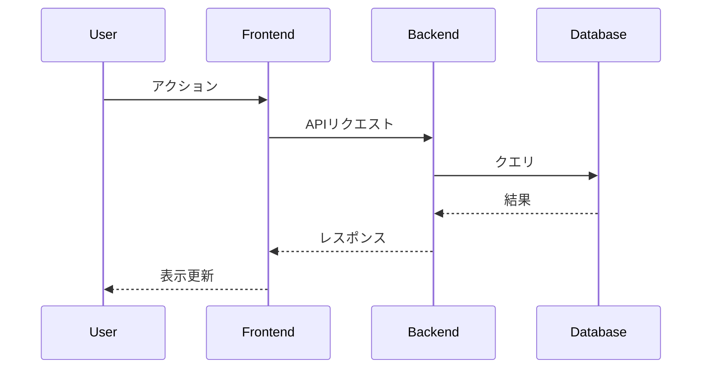
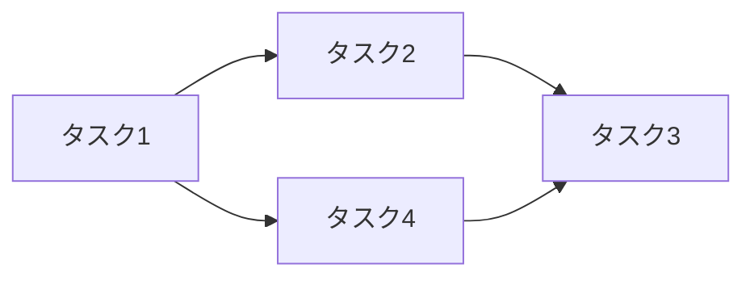

# Design Doc: [機能名/プロジェクト名]

**関連ADR:** [ADR-XXXX](../adr/ADR-XXXX.md)（ある場合）  
**関連PLAN:** [PLAN-type-title](../plans/PLAN-type-title/)（ある場合）

## 概要

[このDesign Docの目的と、解決しようとしている問題の簡潔な説明。2-3段落で記述。]

## 背景と動機

### 現状の問題
[現在のシステムの問題点や制限事項を具体的に記述]

### ビジネス要件
[この設計が満たすべきビジネス要件や目標]

### 技術的制約
[考慮すべき技術的制約や依存関係]

## 設計目標

### 必須要件（Must Have）
- [ ] [絶対に満たすべき要件1]
- [ ] [絶対に満たすべき要件2]

### 希望要件（Nice to Have）
- [ ] [あると良い要件1]
- [ ] [あると良い要件2]

### 非目標（Out of Scope）
- [このDesign Docの範囲外とする事項]

## 提案する設計

### アーキテクチャ概要

```
[アーキテクチャ図やデータフロー図をASCIIアートまたはMermaidで記述]
```

### 主要コンポーネント

#### コンポーネント1: [名前]
**責務:** [このコンポーネントの役割]

**インターフェース:**
```typescript
// 主要な型定義やインターフェース
interface ExampleInterface {
  // ...
}
```

**実装詳細:**
- [重要な実装上の決定事項]
- [使用するライブラリやフレームワーク]

#### コンポーネント2: [名前]
[同様に記述]

### データモデル

```typescript
// 主要なデータ構造
type DataModel = {
  // ...
}
```

### API設計

#### エンドポイント1: [名前]
- **メソッド:** GET/POST/PUT/DELETE
- **パス:** `/api/v1/xxx`
- **リクエスト:** [リクエストボディの構造]
- **レスポンス:** [レスポンスボディの構造]
- **エラーハンドリング:** [エラーケースと対処]

### 状態管理

[状態管理の戦略、使用するライブラリ、データフロー]

### セキュリティ考慮事項

- **認証・認可:** [実装方法]
- **データ保護:** [暗号化、サニタイゼーション等]
- **脆弱性対策:** [考慮すべきセキュリティリスクと対策]

## 詳細設計

### シーケンス図



### エラーハンドリング戦略

| エラー種別 | 対処方法 | ユーザーへの表示 |
|-----------|---------|----------------|
| [エラー1] | [対処] | [メッセージ] |
| [エラー2] | [対処] | [メッセージ] |

### パフォーマンス考慮事項

- **想定負荷:** [同時接続数、リクエスト数等]
- **最適化戦略:** [キャッシング、遅延読み込み等]
- **計測方法:** [パフォーマンス指標と測定方法]

## 実装計画

### フェーズ分け

#### Phase 1: 基盤実装（推定: X日）
- [ ] データモデルの実装
- [ ] 基本的なCRUD操作
- [ ] 単体テスト

#### Phase 2: 機能実装（推定: X日）
- [ ] ビジネスロジックの実装
- [ ] API統合
- [ ] 統合テスト

#### Phase 3: 最適化と仕上げ（推定: X日）
- [ ] パフォーマンス最適化
- [ ] エラーハンドリングの強化
- [ ] ドキュメント整備

### 依存関係



## テスト戦略

### 単体テスト
- **カバレッジ目標:** X%
- **重点テスト項目:** [特に重要なテスト対象]

### 統合テスト
- **テストシナリオ:** [主要なユーザーフロー]
- **テスト環境:** [使用する環境]

### E2Eテスト
- **対象機能:** [E2Eテストを行う機能]
- **テストツール:** [使用するツール]

## 代替案の検討

### 代替案1: [名前]
**概要:** [簡潔な説明]

**長所:**
- [メリット1]
- [メリット2]

**短所:**
- [デメリット1]
- [デメリット2]

**不採用理由:** [なぜ採用しなかったか]

### 代替案2: [名前]
[同様に記述]

## リスクと軽減策

| リスク | 影響度 | 発生確率 | 軽減策 |
|--------|-------|---------|--------|
| [リスク1] | 高/中/低 | 高/中/低 | [対策] |
| [リスク2] | 高/中/低 | 高/中/低 | [対策] |

## 移行計画

### データ移行
- **移行対象:** [移行するデータ]
- **移行方法:** [移行の手順]
- **ロールバック計画:** [問題発生時の対処]

### 段階的リリース
- **Phase 1:** [初期リリース内容]
- **Phase 2:** [次段階のリリース]
- **完全移行:** [最終的な状態]

## モニタリングと運用

### ログとメトリクス
- **ログレベル:** [設定するログレベル]
- **監視項目:** [モニタリングする指標]
- **アラート設定:** [アラートの条件]

### 運用手順
- **デプロイ手順:** [デプロイの方法]
- **障害対応:** [障害時の対応フロー]
- **メンテナンス:** [定期メンテナンスの内容]

## 成功指標

### 技術的指標
- [ ] レスポンスタイム: < Xms
- [ ] エラー率: < X%
- [ ] 可用性: > X%

### ビジネス指標
- [ ] [ビジネス上の成功指標1]
- [ ] [ビジネス上の成功指標2]

## オープンな質問

- [ ] [未決定事項や議論が必要な点1]
- [ ] [未決定事項や議論が必要な点2]

## 参考資料

- [関連するドキュメントへのリンク]
- [参考にした技術記事やライブラリのドキュメント]
- [関連するコードやPRへのリンク]

## 改訂履歴

| 日付 | バージョン | 変更内容 | 変更者 |
|------|-----------|---------|--------|
| YYYY-MM-DD | v1.0 | 初版作成 | [名前] |
| YYYY-MM-DD | v1.1 | [変更内容] | [名前] |

---

*このDesign Docテンプレートは、Googleのデザインドキュメント形式とプロジェクト固有の要件を組み合わせて作成されています。*