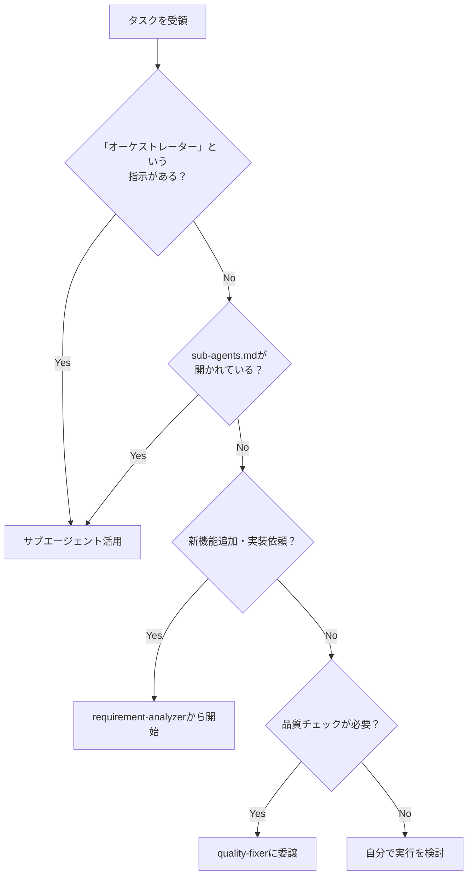
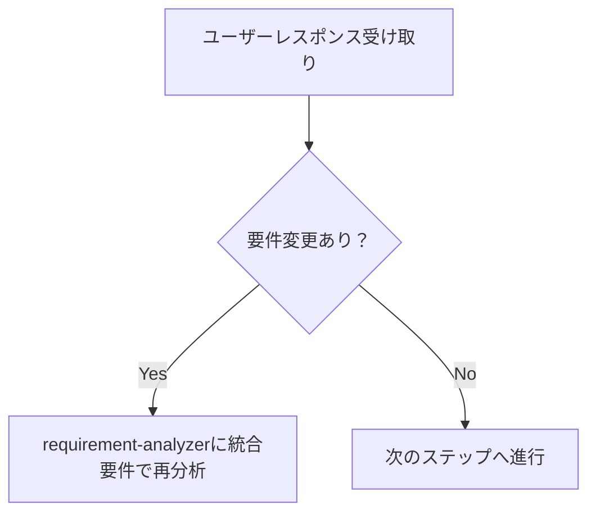
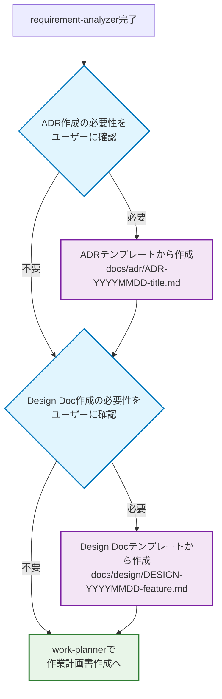
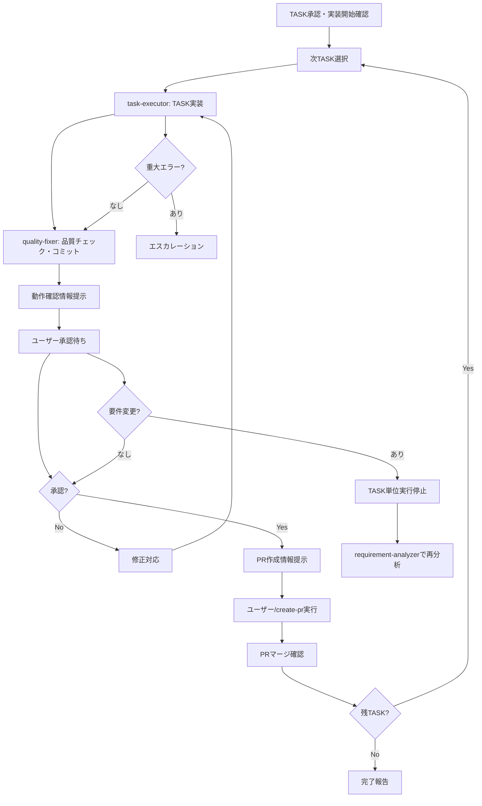

<!--
Based on ai-coding-project-boilerplate by Shinsuke Kagawa
https://github.com/shinpr/ai-coding-project-boilerplate
-->

# Sub-agents ワークフロー - 実行フローと対話ポイント

このドキュメントでは、サブエージェントを活用した実行フローと人間との対話ポイントを詳細に説明します。

## 📑 目次

| セクション | 内容 | 参照 |
|-----------|------|------|
| [📋 タスク受領時の判断フロー](#-タスク受領時の判断フロー) | mermaidダイアグラム付きフロー | - |
| [📋 ユーザーレスポンス処理](#-ユーザーレスポンス受け取り時の判断フロー) | 要件変更検知チェックリスト | - |
| [📄 作業計画フロー](#-作業計画時の基本フロー) | 統一フロー（全規模共通） | [詳細→](./sub-agents-reference.md#-規模判定の解釈基準) |
| [🤖 TASK単位実行モード](#-task単位実行モード段階1-create-pr統合) | 権限委譲と実行方針 | - |
| [⚡ 人間との対話ポイント](#-人間との必須対話ポイント) | 基本原則と停止ポイント | - |
| [🔄 要件変更対応](#-要件変更への対応パターン) | requirement-analyzer活用 | [API→](./sub-agents-reference.md#requirement-analyzer) |

## 📋 タスク受領時の判断フロー



## 📋 ユーザーレスポンス受け取り時の判断フロー



### 要件変更検知チェックリスト

ユーザーレスポンスを受け取ったら以下を確認：
- [ ] **新機能・動作の言及**があるか？（追加の操作方法、別画面での表示、新しいコマンドなど）
- [ ] **制約・条件の追加**があるか？（データ量制限、権限制御、時間制約、対象範囲の変更など）  
- [ ] **技術要件の変更**があるか？（処理方式、出力形式、パフォーマンス、連携方法の変更など）

**判定ルール**: 1つでも該当 → requirement-analyzerに統合要件で再分析

## 📄 作業計画時の基本フロー

新機能や変更依頼を受けたら、まずrequirement-analyzerに要件分析を依頼します。

### 統一フロー（全規模共通）
1. requirement-analyzer → 要件分析 **[停止: 要件確認・質問事項対応]**
2. ADR作成確認 → ユーザーにADR作成の必要性を確認、必要な場合テンプレートから作成 **[停止: ユーザーによるADR作成要否判断]**
3. Design Doc作成確認 → ユーザーにDesign Doc作成の必要性を確認、必要な場合テンプレートから作成 **[停止: ユーザーによるDesign Doc作成要否判断]**
4. work-planner → 作業計画書作成 **[停止: PLAN承認・次ステップ確認]**
5. task-decomposer → TASK分解 **[停止: TASK承認・実装開始確認]**
6. **TASK単位実行モード開始**: 各TASK毎に承認・PR作成サイクル

※ 作業計画書（PLAN）に要件定義、技術設計、実装計画を統合
※ 段階1: /create-pr統合によるTASK単位ワークフロー
※ ADR/Design Docはdocs/adr/、docs/design/に永続的に保存、PLANはdocs/plans/に一時的に作成
※ 各ドキュメントの詳細仕様は[technical-spec.md#設計ドキュメントとプロセス](./technical-spec.md#設計ドキュメントとプロセス)を参照

### ADR/Design Doc作成判断フロー



**判断のポイント**：
- **ADR**: アーキテクチャ決定、技術選定、破壊的変更など
- **Design Doc**: 複雑な機能実装、パフォーマンス要件、セキュリティ要件など
- 両方とも永続保存され、プロジェクトの知識として蓄積されます

## 🤖 TASK単位実行モード（段階1: /create-pr統合）

### 🔑 権限委譲と実行方針

**TASK単位実行モード**：
- 各TASK完了毎にユーザー承認を取得（動作確認・コードレビュー）
- 承認後に`/create-pr`実行を促進してPR作成
- PRマージ確認後に次TASKを自動開始

### TASK単位実行フローの定義



### 🆚 従来の自律実行モードとの違い

| 観点 | 従来の自律実行モード | 新しいTASK単位実行モード |
|------|---------------------|------------------------|
| **承認タイミング** | 実装フェーズ全体の一括承認 | 各TASK完了毎の承認 |
| **PR作成** | 全TASK完了後に一括 | 各TASK完了毎に個別 |
| **ユーザー参加** | 実装中は不参加 | 各TASK毎に動作確認・レビュー |
| **品質チェック** | 最終まとめて実施 | 各TASK毎に実施 |
| **修正対応** | 全体完了後に対応 | TASK毎に即座対応 |

### TASK単位実行の停止条件

以下の場合にTASK単位実行を停止し、ユーザーにエスカレーションします：

1. **要件変更検知時**
   - 要件変更検知チェックリストで1つでも該当
   - TASK単位実行を停止し、requirement-analyzerに統合要件で再分析

2. **重大エラー発生時**
   - 実装エラー、品質チェック失敗、ビルドエラー等
   - エラー内容をユーザーに報告し、対応策の指示を待つ

3. **ユーザー承認拒否時**
   - TASK完了時の動作確認・コードレビューで修正指示
   - 修正対応後に再度承認を求める

4. **PR作成・マージエラー時**
   - `/create-pr`実行失敗やマージコンフリクト等
   - エラー内容をユーザーに報告し、手動対応を依頼

5. **ユーザー明示停止時**
   - 直接的な停止指示や割り込み

### TASK単位実行の品質チェック
- 各TASKごとに`task-executor → quality-fixer → commit → user-approval → PR`サイクルを実行
- quality-fixerに各TASK毎の品質チェックと修正を完全自己完結で処理させる
- ユーザー承認により品質とビジネス要件の両方をチェック

## ⚡ 人間との必須対話ポイント

### 基本原則
- **停止は必須**: 以下のタイミングでは必ず人間の応答を待つ
- **確認→合意のサイクル**: ドキュメント生成後は合意またはupdateモードでの修正指示を受けてから次へ進む
- **具体的な質問**: 選択肢（A/B/C）や比較表を用いて判断しやすく
- **効率より対話**: 手戻りを防ぐため、早い段階で確認を取る

### 主要な停止ポイント
- **requirement-analyzer完了後**: 要件分析結果と質問事項の確認
- **ADR作成確認時**: ユーザーにADR作成の必要性について確認
- **Design Doc作成確認時**: ユーザーにDesign Doc作成の必要性について確認
- **work-planner完了後**: 作業計画書の実装可能性、要件整合性、技術設計妥当性の確認（PLAN承認・次ステップ確認）
- **task-decomposer完了後**: タスクの実行可能性、チェックリスト完全性、依存関係の確認（TASK承認・実装開始確認）

### TASK単位実行中の停止ポイント
- **各TASK完了時**: ユーザーによる動作確認・コードレビュー→承認待ち
- **PR作成前**: `/create-pr`実行促進→ユーザーによるPR作成実行
- **PRマージ確認後**: 次TASKへの進行確認
- **要件変更検知時**: 要件変更チェックリストで該当→requirement-analyzerに戻る
- **重大エラー発生時**: エラー内容報告→対応策指示待ち
- **ユーザー割り込み時**: 明示的な停止指示→状況確認

## 🔄 要件変更への対応パターン

### requirement-analyzerでの要件変更対応
requirement-analyzerは「完全自己完結」の原則に従い、要件変更時も新しい入力として処理します。

#### 要件統合方法

**重要**: 精度を最大化するため、要件は完全な文章として統合し、ユーザーから伝えられた全ての文脈情報を含めて記載する。

```yaml
統合例:
  初回: "ユーザー管理機能を作りたい"
  追加: "権限管理も必要"
  結果: "ユーザー管理機能を作りたい。権限管理も必要。
         
         初回要件: ユーザー管理機能を作りたい
         追加要件: 権限管理も必要"
```

### ドキュメント生成系エージェントの更新モード
ドキュメント生成系エージェント（work-planner、technical-designer、prd-creator）は、`update`モードで既存ドキュメントを更新できます。

- **初回作成**: create（デフォルト）モードで新規ドキュメント作成
- **要件変更時**: updateモードで既存ドキュメントを編集・履歴追加

私が各エージェントを呼ぶタイミングの判断基準:
- **work-planner**: 実行前のみ更新を依頼
- **document-fixer**: PLAN/TASK作成・更新後、ユーザー承認前に必ず実行

## ⚠️ 重要な制約

- **品質チェックは必須**: コミット前にquality-fixerの承認が必要
- **構造化レスポンス必須**: サブエージェント間の情報伝達はJSON形式
- **承認管理**: ドキュメント作成→document-fixer実行→ユーザー承認を得てから次へ進む
- **フロー確認**: 承認取得後は必ず作業計画フロー（大規模/中規模/小規模）で次のステップを確認
- **整合性検証**: サブエージェント判定に矛盾がある場合はガイドラインを優先